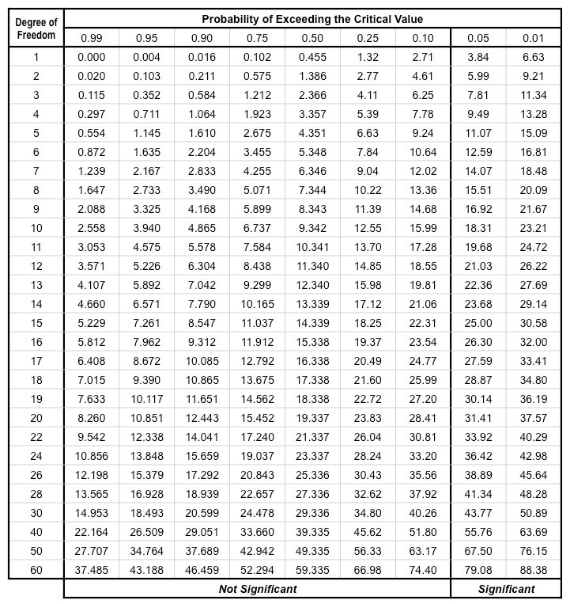
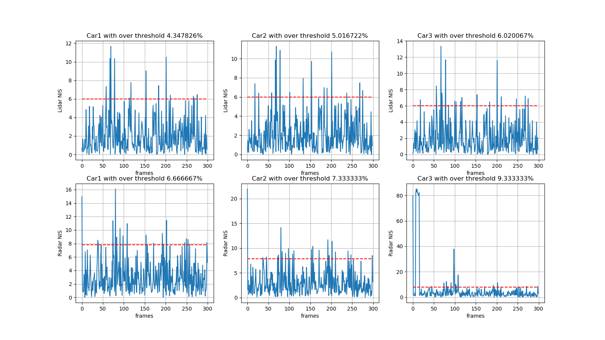

# SFND_Unscented_Kalman_Filter
## About the project
In this project you will implement an Unscented Kalman Filter to estimate the state of multiple cars on a highway using noisy lidar and radar measurements. Passing the project requires obtaining RMSE values that are lower that the tolerance outlined in the project rubric. 

The main program can be built and ran by doing the following from the project top directory.

1. mkdir build
2. cd build
3. cmake ..
4. make
5. ./ukf_highway

Note that the programs that need to be written to accomplish the project are src/ukf.cpp, and src/ukf.h

The program main.cpp has already been filled out, but feel free to modify it.

`main.cpp` is using `highway.h` to create a straight 3 lane highway environment with 3 traffic cars and the main ego car at the center. 
The viewer scene is centered around the ego car and the coordinate system is relative to the ego car as well. The ego car is green while the 
other traffic cars are blue. The traffic cars will be accelerating and altering their steering to change lanes. Each of the traffic car's has
it's own UKF object generated for it, and will update each indidual one during every time step. 

The red spheres above cars represent the (x,y) lidar detection and the purple lines show the radar measurements with the velocity magnitude along the detected angle. The Z axis is not taken into account for tracking, so you are only tracking along the X/Y axis.

### Other Important Dependencies
* cmake >= 3.5
  * All OSes: [click here for installation instructions](https://cmake.org/install/)
* make >= 4.1 (Linux, Mac), 3.81 (Windows)
  * Linux: make is installed by default on most Linux distros
  * Mac: [install Xcode command line tools to get make](https://developer.apple.com/xcode/features/)
  * Windows: [Click here for installation instructions](http://gnuwin32.sourceforge.net/packages/make.htm)
* gcc/g++ >= 5.4
  * Linux: gcc / g++ is installed by default on most Linux distros
  * Mac: same deal as make - [install Xcode command line tools](https://developer.apple.com/xcode/features/)
  * Windows: recommend using [MinGW](http://www.mingw.org/)
 * PCL 1.2

### Basic Build Instructions

1. Clone this repo.
2. Make a build directory: `mkdir build && cd build`
3. Compile: `cmake .. && make`
4. Run it: `./ukf_highway`

### Editor Settings

We've purposefully kept editor configuration files out of this repo in order to
keep it as simple and environment agnostic as possible. However, we recommend
using the following settings:

* indent using spaces
* set tab width to 2 spaces (keeps the matrices in source code aligned)

### Generating Additional Data

This is optional!

If you'd like to generate your own radar and lidar modify the code in `highway.h` to alter the cars. Also check out `tools.cpp` to
change how measurements are taken, for instance lidar markers could be the (x,y) center of bounding boxes by scanning the PCD environment
and performing clustering. This is similar to what was done in Sensor Fusion Lidar Obstacle Detection.

### Project Instructions and Rubric

This information is only accessible by people who are already enrolled in Sensor Fusion. 
If you are enrolled, see the project page in the classroom
for instructions and the project rubric.

---
## Simulation Result
### RMSE error on px, py, vx, vy

### Determine process noise by chi-sqaure distribution
I determined process noise std_a_(Process noise standard deviation longitudinal acceleration in m/s^2) and std_yawdd_(Process noise standard deviation yaw acceleration in rad/s^2) by using chi-sqaure distribution table as belows. 

As can be seen as above table, in case of our project the column of "Degree of Freedom" is the degree of measurement space. Since radar sensor gets sensor values about rho, phi, rho_dot, the DOF of radar sensor is 3. Also lidar sensor gets sensor values about px, py so the DOF of lidar sensor is 2. And I use probability of exceeding critical value as 0.05 so the critical values are 7.81 and 5.99 for the radar and lidar respectively. Plus, I calculated the Normalized Innovation Squared(NIS)(**See below plots.**) By using this information i determine std_a_ as 4.0 and std_yawdd_ as 2.0.

